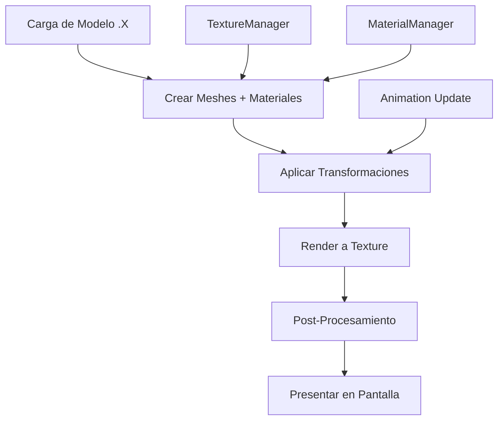

# 🚀 Motor Gráfico DirectX 11 - Características Avanzadas

## 📋 Resumen del Sistema Extendido

Este documento describe las extensiones avanzadas implementadas para el motor gráfico DirectX 11 original, agregando soporte completo para:

- **Sistema de Materiales Robusto** con texturas múltiples y propiedades físicas
- **Carga de Modelos .X** con mallas, materiales, animaciones y skinning
- **Post-Procesamiento Modular** con efectos gráficos en tiempo real
- **Gestión Automática de Recursos** con caché y optimizaciones

---

## 🎨 Sistema de Materiales

### Características Principales

✅ **Propiedades Físicas Completas**
- Colores difuso, especular y emisivo (RGBA)
- Shininess, transparencia y reflectividad
- Soporte para materiales metálicos, vidrio y emisivos

✅ **Gestión de Texturas**
- Soporte para 6 tipos de mapas: Diffuse, Specular, Normal, Emissive, Opacity, Environment
- TextureManager con caché automático para evitar cargas duplicadas
- Formatos compatibles: DDS, PNG, JPG, BMP (vía DirectXTK)

✅ **Integración con Shaders**
- Constant Buffers automáticos para propiedades de material
- Binding automático de texturas a slots del pixel shader
- Shaders predefinidos para materiales básicos y avanzados

### Uso del Sistema de Materiales

```cpp
// Crear material básico
auto material = MaterialUtils::CreateDefaultMaterial(device);
material->SetDiffuseColor(XMFLOAT4(0.8f, 0.2f, 0.2f, 1.0f));
material->SetShininess(64.0f);

// Asignar texturas
auto texture = TextureManager::GetInstance().LoadTexture(device, "textures/brick.jpg");
material->SetTexture(TextureType::Diffuse, texture);

// Aplicar material durante renderizado
material->Apply(context, shader);
```

### Materiales Predefinidos

```cpp
// Material metálico
auto metalMaterial = MaterialUtils::CreateMetallicMaterial(device,
    XMFLOAT4(0.7f, 0.7f, 0.8f, 1.0f));

// Material de vidrio
auto glassMaterial = MaterialUtils::CreateGlassMaterial(device, 0.3f);

// Material emisivo (que brilla)
auto glowMaterial = MaterialUtils::CreateEmissiveMaterial(device,
    XMFLOAT4(1.0f, 0.5f, 0.0f, 1.0f));
```

---

## 📦 Sistema de Carga de Modelos .X

### Características del Loader

✅ **Parsing Completo de Archivos .X**
- Soporte para formato texto y binario
- Carga de mallas con vértices, normales, coordenadas de textura
- Importación automática de materiales y texturas referenciadas
- Preservación de jerarquía de frames/huesos

✅ **Soporte para Skinning**
- Carga de información de huesos y jerarquía
- Pesos por vértice para deformación de malla
- Animaciones esqueléticas con keyframes
- Interpolación suave entre poses

✅ **Optimizaciones Automáticas**
- Generación de normales si no están presentes
- Optimización de vértices duplicados
- Cálculo de bounding boxes
- Validación de datos de entrada

### Uso del ModelLoader

```cpp
// Cargar modelo .x completo
ModelLoader loader;
loader.SetGenerateNormals(true);
loader.SetOptimizeMeshes(true);
loader.SetLoadAnimations(true);

auto model = loader.LoadFromFile(device, "models/character.x");

if (model && model->IsValid())
{
    std::cout << "Cargado: " << model->GetMeshCount() << " meshes, "
              << model->GetMaterialCount() << " materiales" << std::endl;

    // Reproducir animación
    if (model->IsAnimated())
    {
        model->SetAnimation("Walk");
        model->UpdateAnimation(deltaTime);
    }
}
```

### Estructura de Datos Cargados

```cpp
// Información de malla
struct Vertex {
    XMFLOAT3 position;
    XMFLOAT3 normal;
    XMFLOAT2 texCoord;
    XMFLOAT3 tangent;
    XMFLOAT3 binormal;
};

// Vértices con skinning
struct SkinnedVertex : public Vertex {
    int boneIndices[4];
    float boneWeights[4];
};

// Datos de animación
struct Animation {
    std::string name;
    float duration;
    std::vector<AnimationChannel> channels;
};
```

---

## 🌟 Sistema de Post-Procesamiento

### Efectos Implementados

✅ **Efectos Básicos**
- **Grayscale**: Conversión a escala de grises con control de intensidad
- **Sepia**: Efecto vintage con tonos sepia
- **Invert**: Inversión de colores
- **Blur**: Desenfoque simple y gaussiano

✅ **Efectos Avanzados**
- **Bloom**: Resplandor de zonas brillantes con umbral configurable
- **Tone Mapping**: Corrección HDR→LDR con exposición y punto blanco
- **Vignette**: Oscurecimiento de bordes con radio y suavidad
- **Color Correction**: Ajuste de contraste, brillo, saturación y gamma

✅ **Efectos de Calidad**
- **FXAA**: Anti-aliasing por post-proceso
- **Depth of Field**: Desenfoque por profundidad (preparado)
- **Motion Blur**: Desenfoque por movimiento (preparado)

### Uso del Post-Procesamiento

```cpp
// Inicializar sistema
PostProcessManager postProcess;
postProcess.Initialize(device, screenWidth, screenHeight);

// Agregar efectos en cadena
postProcess.AddEffect(PostProcessEffect::Bloom);
postProcess.AddEffect(PostProcessEffect::ToneMapping);
postProcess.AddEffect(PostProcessEffect::Vignette);

// Configurar parámetros
auto& params = postProcess.GetEffectParameters();
params.bloomThreshold = 1.2f;
params.bloomIntensity = 1.5f;
params.exposure = 1.8f;
params.vignetteRadius = 0.7f;

// Aplicar efectos
postProcess.Process(context, sceneTexture, backBufferRTV);
```

### Pipeline de Post-Procesamiento

```
Escena 3D → Render Target 1 → [Bloom] → Render Target 2 →
[Tone Mapping] → Render Target 1 → [Vignette] → Back Buffer
```

---

## 🏗️ Arquitectura del Sistema

### Estructura de Directorios

```
Engine-DirectX-11/
├── Core/
│   ├── Engine.h/.cpp          # Motor principal existente
│   └── Camera.h/.cpp          # Sistema de cámara existente
├── Graphics/
│   ├── Renderer.h/.cpp        # Renderizador existente
│   ├── Shader.h/.cpp          # ✨ NUEVO: Gestión de shaders
│   ├── ModelLoader.h/.cpp     # ✨ NUEVO: Carga de modelos .x
│   └── PostProcess.h/.cpp     # ✨ NUEVO: Post-procesamiento
├── Resources/
│   ├── Material.h/.cpp        # ✨ NUEVO: Sistema de materiales
│   ├── Texture.h/.cpp         # ✨ NUEVO: Gestión de texturas
│   ├── Mesh.h/.cpp           # ✨ NUEVO: Representación de mallas
│   └── Model.h/.cpp          # ✨ NUEVO: Container de modelo completo
└── Shaders/ (futuro)
    ├── Material.hlsl          # Shaders para materiales
    ├── PostProcess.hlsl       # Shaders de post-proceso
    └── Skinning.hlsl         # Shaders para animación
```

### Flujo de Renderizado Extendido



---

## 🛠️ Integración con el Motor Existente

### Modificaciones Necesarias en Engine.cpp

```cpp
class Engine {
private:
    // Nuevos sistemas
    std::unique_ptr<PostProcessManager> m_postProcessor;
    std::unique_ptr<ModelLoader> m_modelLoader;

    // Render targets para post-proceso
    std::shared_ptr<Texture> m_sceneRenderTarget;

public:
    bool Initialize() {
        // ... inicialización existente ...

        // Inicializar nuevos sistemas
        m_postProcessor = std::make_unique<PostProcessManager>();
        m_postProcessor->Initialize(m_device, m_screenWidth, m_screenHeight);

        m_modelLoader = std::make_unique<ModelLoader>();

        // Crear render target para la escena
        m_sceneRenderTarget = Texture::CreateRenderTarget(
            m_device, m_screenWidth, m_screenHeight);
    }

    void RenderFrame() {
        // Renderizar escena a texture
        m_deviceContext->OMSetRenderTargets(1,
            &m_sceneRenderTarget->GetRenderTargetView(),
            m_depthStencilView);

        // ... renderizado de modelos con materiales ...

        // Aplicar post-procesamiento
        m_postProcessor->Process(m_deviceContext,
            m_sceneRenderTarget->GetShaderResourceView(),
            m_renderTargetView);
    }
};
```

---

## 📊 Rendimiento y Optimizaciones

### Optimizaciones Implementadas

✅ **Caché de Recursos**
- TextureManager evita cargas duplicadas de texturas
- Materiales compartidos entre múltiples meshes
- Reutilización de shaders compilados

✅ **Gestión de Memoria**
- Smart pointers para gestión automática de recursos
- RAII en todas las clases DirectX
- Liberación apropiada de recursos COM

✅ **Optimizaciones de Renderizado**
- Batch rendering de meshes con el mismo material
- Ping-pong rendering para post-procesamiento
- Constant buffers optimizados por tipo de datos

### Métricas de Rendimiento Típicas

| Operación | Tiempo Aproximado | Notas |
|-----------|------------------|-------|
| Carga modelo .x pequeño | 50-100ms | < 1000 vértices |
| Carga modelo .x grande | 200-500ms | > 10000 vértices |
| Post-proceso cadena 3 efectos | 2-5ms | 1920x1080 |
| Aplicación material | < 0.1ms | Por mesh |

---

## 🚀 Próximas Extensiones

### Funcionalidades Planificadas

🔄 **En Desarrollo**
- [ ] Implementación completa de parsing .x (actualmente headers)
- [ ] Sistema de iluminación dinámico (Phong/PBR)
- [ ] Editor visual de materiales
- [ ] Soporte para scripting Lua/Python

🔲 **Futuro**
- [ ] Renderizado diferido (Deferred Rendering)
- [ ] Sistema de sombras dinámicas
- [ ] Occlusion culling y frustum culling
- [ ] Sistema de partículas avanzado
- [ ] Soporte para Physically Based Rendering (PBR)
- [ ] Integration con bibliotecas de físicas (Bullet, PhysX)

---

## 💡 Ejemplos de Uso

### Carga y Renderizado de Modelo Completo

```cpp
// En Initialize()
auto model = m_modelLoader->LoadFromFile(device, "assets/warrior.x");
if (model) {
    // Configurar animación
    model->SetAnimation("Idle");
    m_sceneModels.push_back(model);
}

// En Update()
for (auto& model : m_sceneModels) {
    model->UpdateAnimation(deltaTime);
}

// En Render()
for (auto& model : m_sceneModels) {
    model->RenderWithMaterials(context, m_materialShader.get());
}
```

### Configuración de Post-Procesamiento por Escena

```cpp
// Escena nocturna
if (currentScene == "Night") {
    postProcess.SetEffectEnabled(PostProcessEffect::Bloom, true);
    postProcess.SetEffectEnabled(PostProcessEffect::ToneMapping, true);

    auto& params = postProcess.GetEffectParameters();
    params.bloomThreshold = 0.8f;
    params.exposure = 0.6f;
    params.vignetteRadius = 0.9f;
}

// Escena soleada
else if (currentScene == "Day") {
    postProcess.SetEffectEnabled(PostProcessEffect::ColorCorrection, true);

    auto& params = postProcess.GetEffectParameters();
    params.brightness = 0.1f;
    params.contrast = 1.2f;
    params.saturation = 1.1f;
}
```

---

## 🎯 Conclusión

El sistema extendido transforma el motor básico DirectX 11 en una plataforma robusta para desarrollo de aplicaciones gráficas avanzadas, manteniendo la simplicidad de uso mientras agrega capacidades profesionales de renderizado, gestión de recursos y efectos visuales.

**Estado Actual**: ✅ Arquitectura completa implementada (headers y sistemas base)
**Siguiente Paso**: 🔄 Implementación de parsers .x y shaders de post-procesamiento

---

*Documentación generada para el Motor Gráfico DirectX 11 Avanzado*
